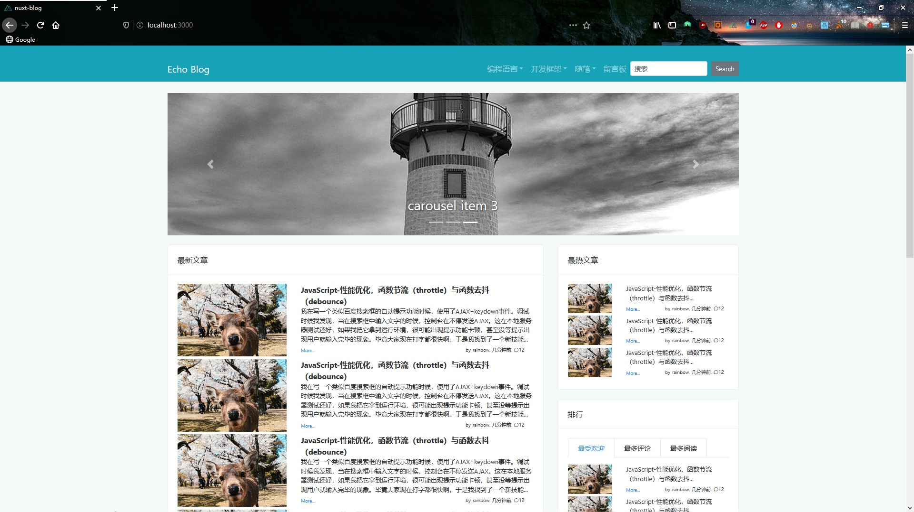
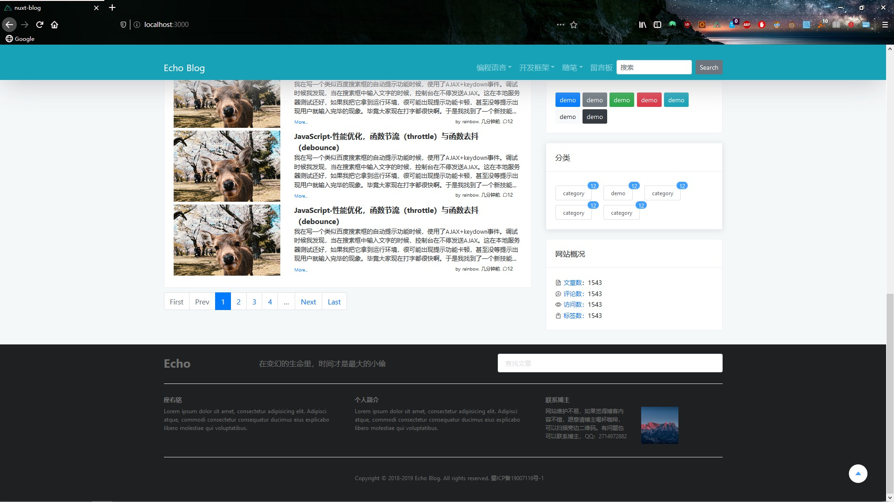
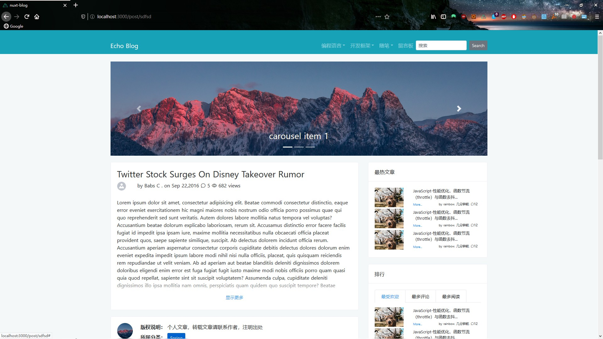
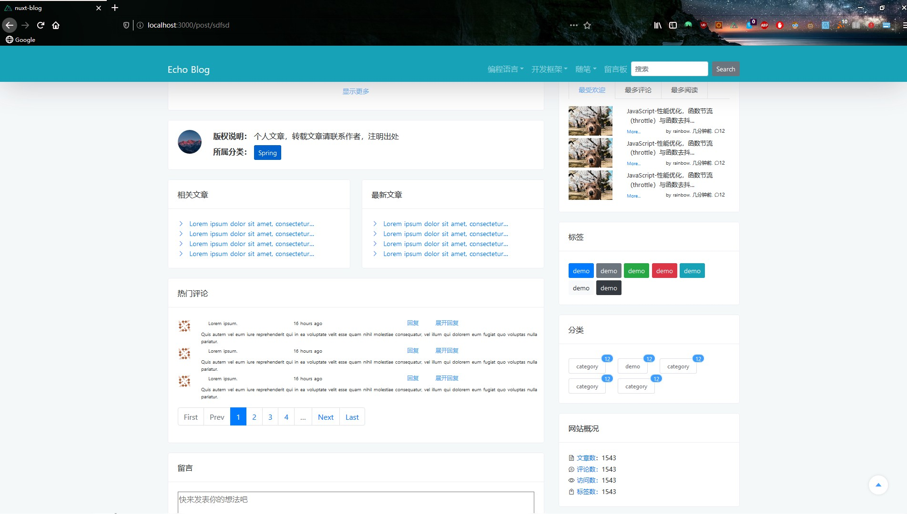
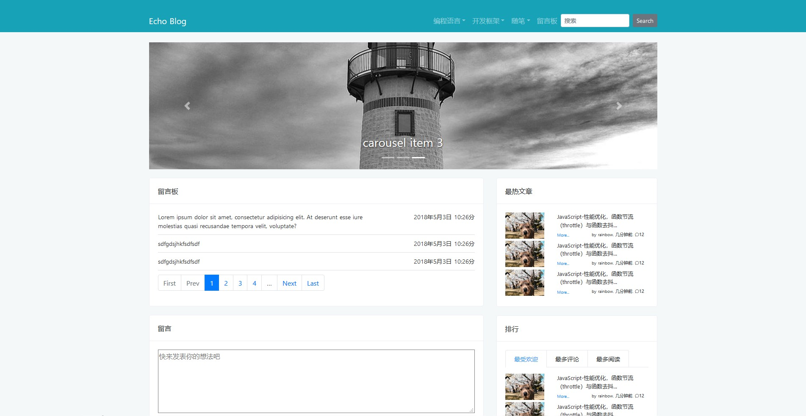
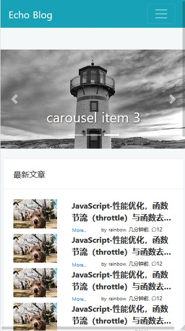
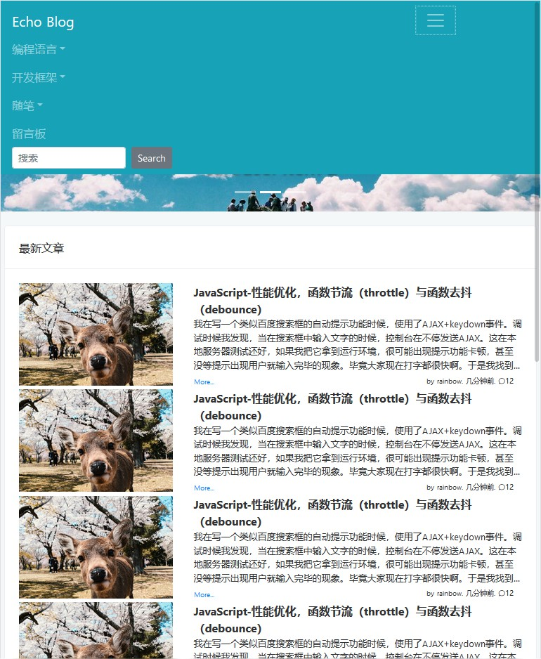
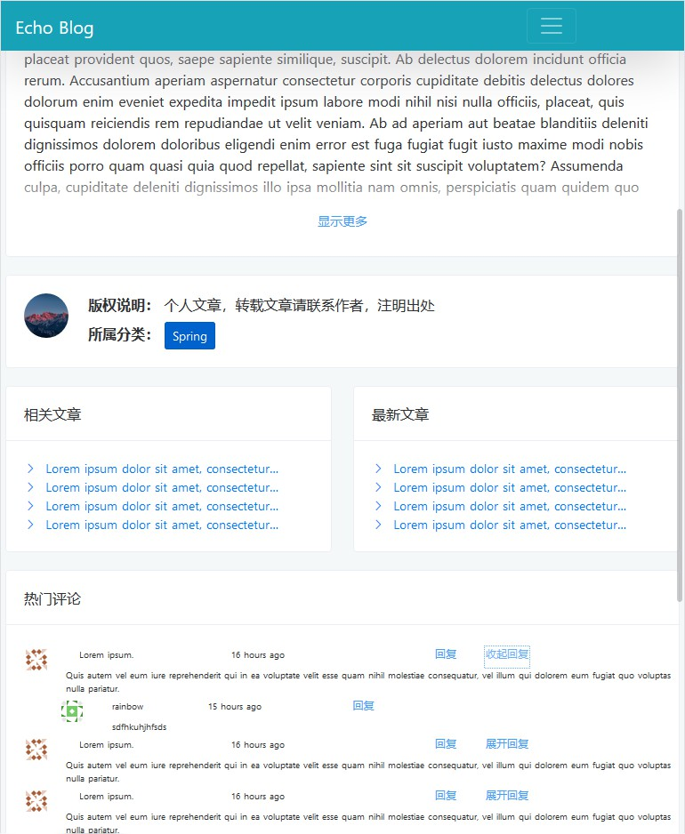

# nuxt-blog

本项目是基于nuxt.js和vue.js开发的个人博客前台门户网站，使用了BootstrapVue和ElementUI框架进行样式的丰富，实现了响应式布局与SSR服务器端渲染的效果。非常适合用于nuxt.js入门以及想要创建SSR端网站的开发者。

本项目本身也是对我自己另一个项目的增强，见：https://gitee.com/rainbowecho/vue-element-blog

未来此项目将会添加Dockerfile使其镜像化，便于发布与部署。

## Build Setup

``` bash
# install dependencies
$ npm run install

# serve with hot reload at localhost:3000
$ npm run dev

# build for production and launch server
$ npm run build
$ npm run start

# generate static project
$ npm run generate
```

For detailed explanation on how things work, check out [Nuxt.js docs](https://nuxtjs.org).

## 运行效果

### pc端效果







### 移动端效果





## 最后

欢迎PR和fork，如果觉得不错的话希望点个star！！
